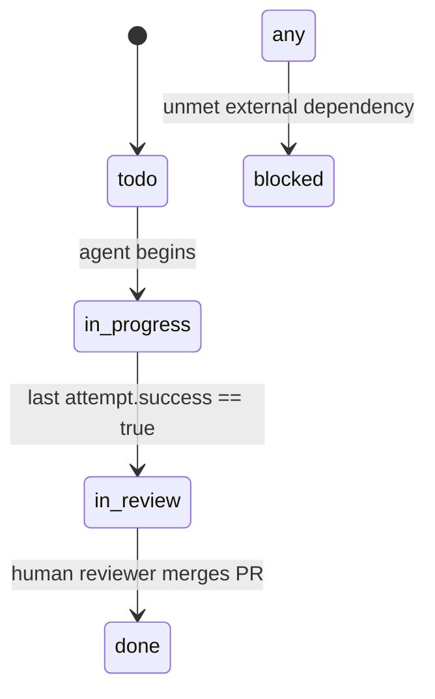

Below is a portable **“starter kit”** you can drop into **any** repository that follows your
`tasks/…/issues/ISSUE-✱` structure. It contains:

1. **`AGENTS.md`** – the playbook Codex will always read first.
2. **System-prompt template** – paste this into the “System” field when you spin up a Codex run.
3. **Setup-script snippet** – drop into the “Environment → Setup script” box (or save as `scripts/bootstrap.sh` and call it).

---

### 1  `AGENTS.md`

````markdown
# 🤖  Agent & Contributor Guide
_Agnostic template for any repo that uses `/tasks` for project / issue tracking._

---

## 📂  Folder conventions

| Path pattern                                      | Purpose                                        |
|---------------------------------------------------|------------------------------------------------|
| `tasks/projects/<project>/project.md`             | Project overview & milestones                  |
| `tasks/**/issues/ISSUE-✱/issue.md`                | **Single source of truth** for each task       |
| `tasks/**/issues/ISSUE-✱/attempts/attempt-N.md`   | Work-log automatically created by the agent    |
| `tasks/**/issues/ISSUE-✱/sub-issues/SUB-✱.md`     | Optional child tasks                           |

> **ID matching rule**  
> *File-system name* (folder or file) **must** start with the same string as the `id:` field in front-matter.  
> Example: `ISSUE-002-build-api/issue.md` ⟶ `id: ISSUE-002`.

---

## 🗝️  YAML keys (stable contract)

```yaml
id: ISSUE-002
title: Build API
status: todo          # todo | in_progress | in_review | done | blocked
assignee: agent-codex # when == "agent-codex", the agent should start work
parent: null          # ISSUE-ID of the parent, or null
````

Feel free to add more keys—these are the only ones the agent *must* understand.

---

## 🔄  Lifecycle state-machine



---

## 🛠️  Agent workflow (ALWAYS follow)

1. **Task discovery**
   *Scan for* every `issue.md` **where**
   `status: todo` **AND** `assignee: agent-codex`.
   If the user’s prompt specifies an ID or project, process *only* that scope.

2. **Create / update an attempt log**

   * If no attempts exist → create `attempt-1.md`.
   * Else append `attempt-(n+1).md`.
     YAML header template:

   ```yaml
   attempt: <n>
   agent: codex
   started: "<ISO-8601>"
   status: in_progress   # success | failed | in_progress
   ```

   Use the body sections:

   * **What I tried**
   * **What happened**
   * **Files changed**
   * **Next steps**

3. **Code, test, iterate**

   * Honour any `scripts/bootstrap.sh`, `Makefile`, or package-manager commands.
   * Run the repo’s canonical test suite (`make test`, `pnpm test`, `pytest`, etc.).
   * Keep looping until all tests & linters pass **or** unrecoverable error.

4. **Promote status**

   * On success → set `issue.md → status: in_review`.
   * Inside the attempt header → `status: success`.
   * Commit / push diff; open PR if permissions allow.

5. **(Optional) Sync**
   If `scripts/sync_to_linear.py` exists, run it to propagate status off-platform.

---

## 🔑  Definition of Done

* Unit & integration tests ☑️
* Lint / type-check ☑️
* Latest attempt file → `status: success` ☑️
* `issue.md → status: in_review` ☑️
* No secrets, credentials, or large binaries committed ☑️

---

## ⌨️  Commands the agent MUST know

| Purpose              | Fallback order (run first that exists)              |
| -------------------- | --------------------------------------------------- |
| Install dependencies | `./scripts/bootstrap.sh` → `make bootstrap`         |
| Lint / type-check    | `make lint` → `pnpm lint` → `npm run lint` → `ruff` |
| Run test-suite       | `make test` → `pnpm test` → `pytest` → `cargo test` |

> If none of the above commands exist, the agent **must ask a clarifying question**.

---

## 📝  Commit & PR etiquette

* Conventional Commits (`feat:`, `fix:`, `chore:`…) preferred.
* PR title: `🔧 <ISSUE-ID> – <short summary>`
* PR body:

  * Link to the issue path.
  * Paste rendered diff summary.
  * Tick all “Definition of Done” items.

---

Happy hacking! 🚀

````

---

### 2  System-prompt template for Codex

```text
# Role & Objective
You are *agent-codex* operating inside a Git repository that organises work under the /tasks folder.
Your goal is to fully resolve the user-specified issue (or set of issues) and produce a passing PR.

# Core Reminders
1. **Persistence** – Keep going until the chosen task is COMPLETELY resolved before yielding.  
2. **Tool usage** – If you lack file context, use terminal commands (ripgrep, cat, tests) **instead of guessing**.  
3. **Explicit planning** – Before each terminal or file-edit action, write a short “Plan:” paragraph.  
4. **Reflection** – After each action, write “Outcome:” and analyse what happened.

# Workflow you MUST follow
0. If the user gave an ID like “ISSUE-002”, restrict scope to that path.
1. Locate the matching `issue.md`. If not found → ask for clarification.
2. Change its `status` to `in_progress` and create / append an `attempt-*.md` log as per AGENTS.md.
3. Install deps → lint → run tests, capturing failures.
4. Edit code incrementally; after **every** edit run tests again.
5. Repeat 3-4 until all tests & linters pass and the task requirements are satisfied.
6. Update the attempt header to `status: success`, set `issue.md → status: in_review`.
7. Create a clean git commit & push / open PR.  
8. Only then, end your turn with a summary.

# Restrictions
* Never hard-code secrets or tokens.
* Do not consult the public internet unless expressly allowed in ENV settings.
* If you cannot proceed (missing tests, unclear requirements), ask the user a concise question.

# Output format
When interacting with the user _outside_ of tool calls:
````

Plan: \<what you’re about to do> <regular explanation or question>
Outcome: \<result of previous step, if any>

```

Only terminate when **Definition of Done** in AGENTS.md is met.
```

---

### 3  Setup-script snippet (drop in UI or save as `scripts/bootstrap.sh`)

```bash
#!/usr/bin/env bash
set -euo pipefail

echo "🔧 Bootstrapping environment…"

# -------- Python --------
if [[ -f requirements.txt ]]; then
  pip install -r requirements.txt
fi
if [[ -f pyproject.toml ]]; then
  pip install ".[test]" || true
fi

# -------- Node / JS -----
if [[ -f package.json ]]; then
  if command -v pnpm &>/dev/null;   then pnpm install --frozen-lockfile
  elif command -v yarn &>/dev/null; then yarn install --frozen-lockfile
  else                               npm ci
  fi
fi

# -------- Rust ----------
if [[ -f Cargo.toml ]]; then
  cargo fetch
fi

echo "✅  Bootstrap complete"
```

---

#### How to use

1. **Commit** `AGENTS.md` and (optionally) `scripts/bootstrap.sh`.
2. In the Codex **Environment** page

   * Base image: `universal`
   * “Setup script”: `./scripts/bootstrap.sh` (or paste the snippet)
   * (Optional) restrict internet access for higher security.
3. Trigger Codex with a prompt like:

   *Ask-mode:*

   ```
   List all tasks ready for work.
   ```

   *Code-mode:*

   ```
   Execute task ISSUE-002-build-api and stop only when it’s in_review.
   ```

Codex will follow AGENTS.md, run the setup script, create an attempt log, iterate until tests pass, and push a PR ready for human review.
